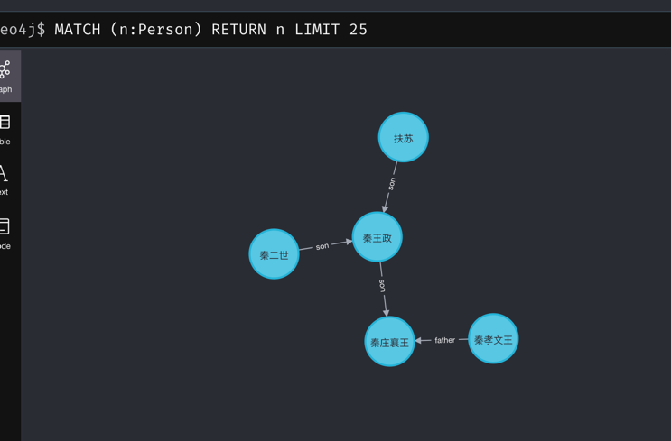

# 背景说明

在前公司使用过图数据库，发现图数据库是一个很有意思的数据库，它可以描述数据与数据之间的某种关系等优势，于是决定做一个家族族谱小产品，
用秦始皇的家族族谱作为示例数据。用户可以自己添加自己的家族族谱，然后系统会将这些数据渲染成一个族谱树。

# 环境说明及搭建

1. neo4j搭建

```shell
# docker怎么搭建就自己去学习学习了
docker pull neo4j
```

2. 启动neo4j

```shell
# 这里我将数据目录、配置目录、日志目录映射到我本地/Users/xx/my/neo4j对应的目录下，用户名和密码为neo4j/password
docker run -d --name neo4j_demo -p 7474:7474 -p 7687:7687 -v /Users/xx/my/neo4j/data:/data -v //Users/xx/my/neo4j/logs:/logs -v /Users/xx/my/neo4j/conf:/var/lib/neo4j/conf -v /Users/xx/my/neo4j/import:/var/lib/neo4j/import --env NEO4J_AUTH=neo4j/password neo4j
# 可以通过如下命令查看是否启动成功，看到 **INFO  Started.相关日志代表启动成功
docker logs -f neo4j_demo
# 可以访问 http://localhost:7474/browser/ 访问neo4j的web端
```

# 配置说明，项目启动相关的配置在根目录下config.json文件中，自行参考配置。

```json
{
  "mode": "debug",
  "port": 8180,
  "log": {
    "level": "debug",
    "filename": "app.log",
    "maxsize": 200,
    "max_age": 7,
    "max_backups": 10
  },
  "neo4JConfig": {
    "url": "localhost",
    "user": "neo4j",
    "password": "password"
  }
}
```

# 项目运行

```shell
go run main.go
```

# 功能说明

1. 模糊查询用户
2. 创建用户
3. 创建用户关系
4. 通过关系查询相关用户
5. 查询某人的具体信息
# 功能效果图展示


# 未来规划

1. ing...
2. 批量创建关系 并在关系上添加labels，例如 A是B的父亲、同时是C的丈夫，A不存在B C数据都存在，我在创建A的时候我需要将这些关系加上，并加上labels
   ，例如AC是什么时候结婚的在这个丈夫的关系上加上married_date等
3. 用户输入一段关系描述信息，解析这段信息并将用户信息及关系自动创建并绑定，考虑接入ChatGPT

# TODO

1. 后台提供http服务
2. 编写前端页面

# REFERENCE

1. https://www.liwenzhou.com/posts/Go/zap-in-gin/
2. https://github.com/gin-gonic/gin
3. https://www.w3cschool.cn/neo4j/
4. https://zh.wikipedia.org/zh-hans/%E7%A7%A6%E5%9C%8B%E5%90%9B%E4%B8%BB%E5%88%97%E8%A1%A8
5. ChatGPT